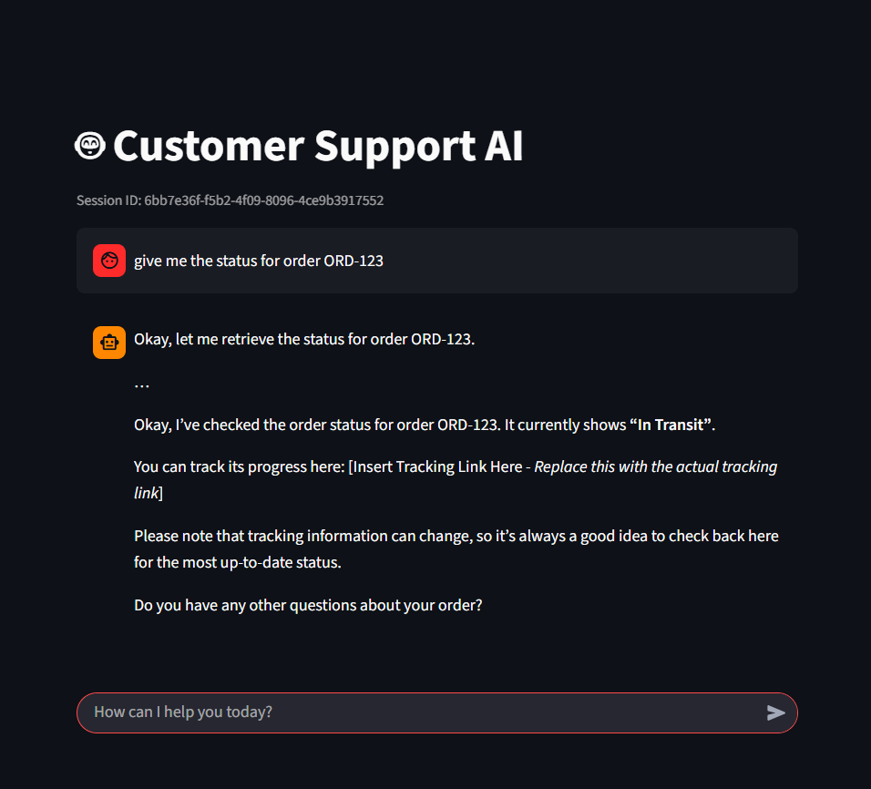
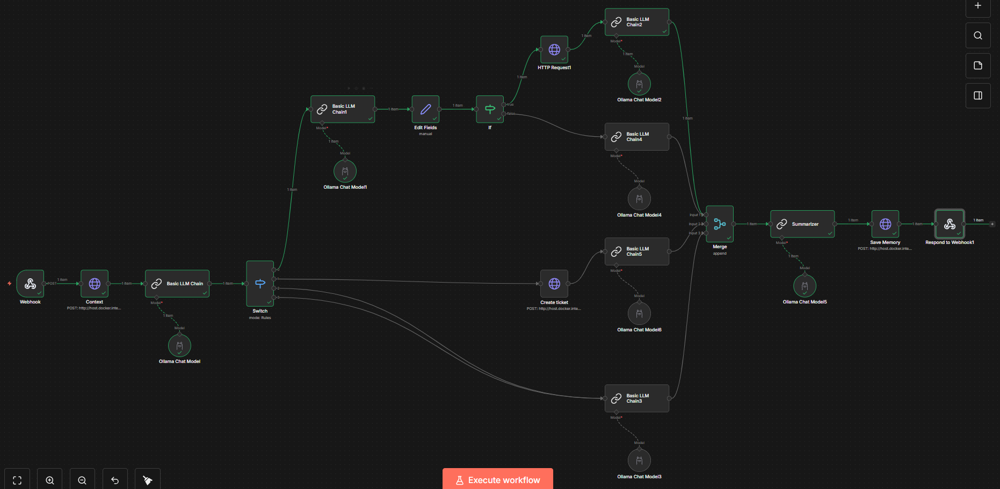

# 🤖 Agentic AI Customer Support System

A local, multi-agent customer support system orchestrated by **n8n**, powered by **Ollama (Gemma 3)**, and enhanced with **Vector Memory (ChromaDB)**.

This project demonstrates how to build an "Agentic" workflow where an AI can route tasks, call external Python tools (APIs), and remember past conversations to provide context-aware support.

---

## 🏗️ System Architecture

The system consists of three main parts:
1.  **Frontend:** A **Streamlit** chat interface for the user.
2.  **Orchestrator:** An **n8n** workflow that acts as the "Brain", making decisions and routing logic.
3.  **Backend Tools:** **FastAPI** microservices handling Memory (RAG) and Business Logic (Orders/Tickets).

### 🛠️ Technologies Used
* **Orchestration:** n8n (Self-hosted)
* **LLM:** Ollama (Gemma 3)
* **Frontend:** Python (Streamlit)
* **Backend:** Python (FastAPI, Uvicorn)
* **Database:** ChromaDB (Vector Store for Memory)

---

## 🚀 Implemented Features

I implemented a robust routing workflow handling three distinct scenarios:

1.  **📦 Order Status:**
    * Extracts the `Order ID` (e.g., "ORD-123") from the user's message.
    * Calls a custom Python tool to fetch real-time shipping status.
    * Returns the specific status to the user.

2.  **🎫 Product Issues (Ticket Creation):**
    * Detects complaints or product defects.
    * Automatically calls a "Create Ticket" API endpoint.
    * Returns a generated **Ticket ID** and Priority level to the user.

3.  **ℹ️ / ⚠️ FAQ & Escalation (Combined Branch):**
    * Handles general questions using RAG (Retrieval-Augmented Generation) from memory.
    * Detects high-stress situations to offer "Escalation" to a human agent.
    * Uses a single intelligent LLM node to handle both cases contextually.

---

## 📸 Workflow & Execution

### 1. The Main User Interface
*The Streamlit chat interface showing the conversation history and AI responses.*


### 2. n8n Workflow Overview
*The complete logical flow: Webhook → Memory Retrieval → Classification → Routing → Tools → Memory Saving → response.*


---

## 📂 Project Structure & Python Services

### `tools_service.py` (Business Logic)
Hosted on Port `8002`. This API mimics a real e-commerce backend.
* **Endpoint:** `GET /order/{order_id}` - Returns shipping status.
* **Endpoint:** `POST /create_ticket` - Generates a support ticket for product issues.

### `memory_service.py` (Vector Memory)
Hosted on Port `8001`. Handles long-term memory.
* **Library:** `chromadb`
* **Endpoint:** `POST /query_memory` - Retrieves relevant past conversation snippets.
* **Endpoint:** `POST /add_memory` - Stores a summary of the current interaction.

### `app.py` (Frontend)
Hosted on Port `8501`.
* Connects to the n8n Webhook.
* Manages user sessions (Session State) to keep track of the conversation context.

---

## ⚙️ How to Run

1.  **Start Ollama:**
    ```bash
    ollama serve
    ollama run gemma3
    ```

2.  **Start Python Services:**
    ```bash
    # create venv and install dependencies
    python -m venv venv
    source venv/bin/activate
    pip install -r requirements.txt

    # Terminal 1
    python memory_service.py

    # Terminal 2
    python tools_service.py
    ```

3.  **Start n8n:**
    ```bash
    docker run -it \
    --name n8n \
    -p 5678:5678 \
    -v n8n_data:/home/node/.n8n \
    n8nio/n8n

    # Import the n8n-workflow.json and activate it.
    ```

4.  **Launch UI:**
    ```bash
    streamlit run app.py
    # NB: the UI uses the test URL of the webhook
    ```